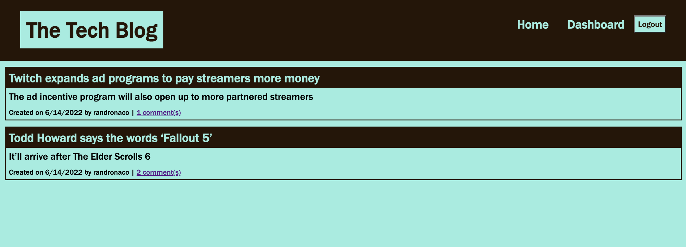
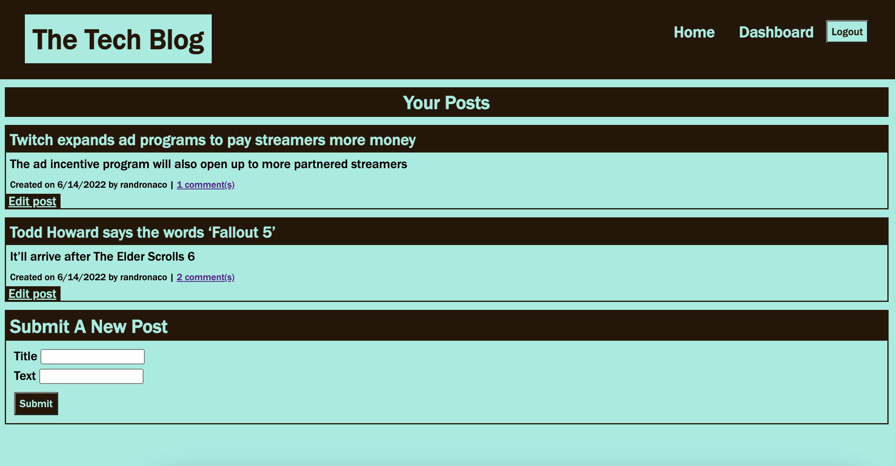
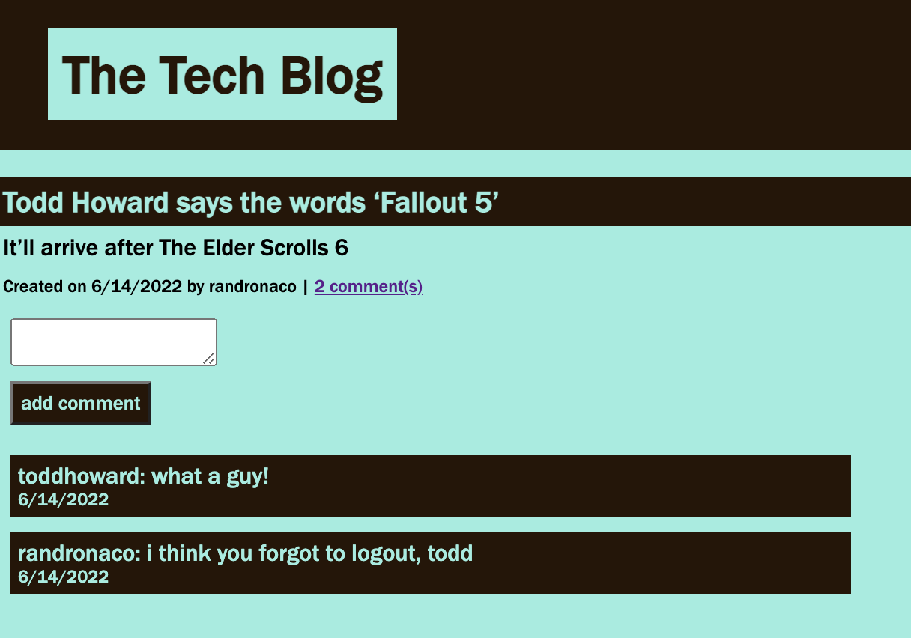

# tech-blog-MVC

## User Story

AS A developer who writes about tech

I WANT a CMS-style blog site

SO THAT I can publish articles, blog posts, and my thoughts and opinions

## Usage

A user is presented with a blank landing page.

They can then  click on the Login button and register an account or login with an existing account. 

If they register an account, that account is added to the database and they are logged in.

When they are logged in they are presented with all the Tech Blog posts.

When they go to the dashboard they can view all posts they've entered and add a new post.

They can also edit or delete previous posts.

If they click on the comments of a post they are taken to the page for that specific post and can view all of the comments.

They can also leave their own comment.

When the user logs out the session has ended.

## Preview of Application

Main Page

Dashboard

Login

Comments

## Technologies Used

dotenv

express

express-handlebars

express-session

mysql2

sequelize

## URLs

Heroku: https://gentle-plains-69704.herokuapp.com/ 

GitHub Repo: https://github.com/randronaco1027/tech-blog-MVC 